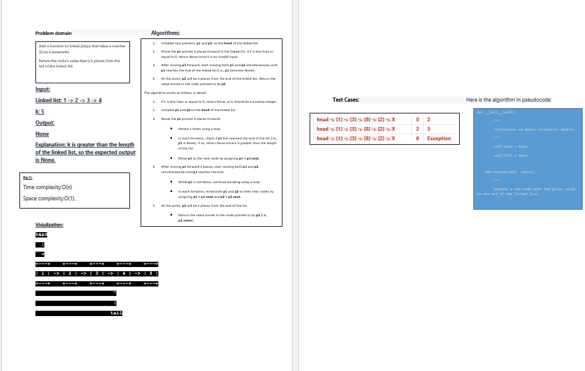

# Challenge Title
linked list kth

## Whiteboard Process

## Approach & Efficiency
Approach:

The append method adds a new node to the end of the linked list. It creates a new Node object with the given value and updates the head and tail pointers accordingly.

The kth_from_end method returns the value of the node that is k places from the end of the linked list. It uses two pointers, p1 and p2, initially set to the head of the linked list.

First, p1 is moved k places forward in the linked list. If k is greater than the length of the linked list or less than or equal to 0, it returns None since it is an invalid input.

After moving p1 forward, both p1 and p2 are moved simultaneously until p1 reaches the end of the linked list. At this point, p2 will be k places from the end.

Finally, it returns the value of the node pointed to by p2.

Efficiency:

The append method has a time complexity of O(1) since it simply adds a new node at the tail of the linked list.

The kth_from_end method has a time complexity of O(N), where N is the length of the linked list. It involves two passes through the linked list. The first pass moves the p1 pointer k places forward, which takes O(k) time. The second pass moves both p1 and p2 simultaneously until p1 reaches the end, which takes O(N - k) time in the worst case. Therefore, the overall time complexity is O(k + (N - k)) = O(N).

Both the append and kth_from_end methods have a space complexity of O(1) since they do not use any additional data structures that grow with the size of the linked list.

## big O :
The append method has a time complexity of O(1) since it performs a constant number of operations regardless of the size of the linked list.

The kth_from_end method has a time complexity of O(N), where N is the length of the linked list. It involves two passes through the linked list: one pass to move p1 k places forward and another pass to move both p1 and p2 simultaneously until p1 reaches the end. In the worst case, k could be equal to N, resulting in a time complexity of O(N).

The space complexity for both the append and kth_from_end methods is O(1) since they do not require any additional memory that grows with the size of the linked list. They only utilize a constant amount of memory to store the pointers and temporary variables.

## Solution
pytest linked_list_kht.py

