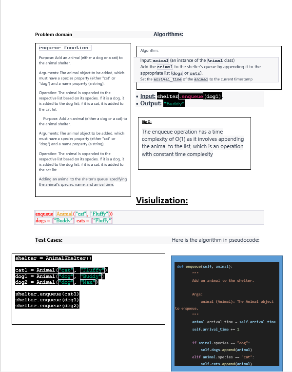
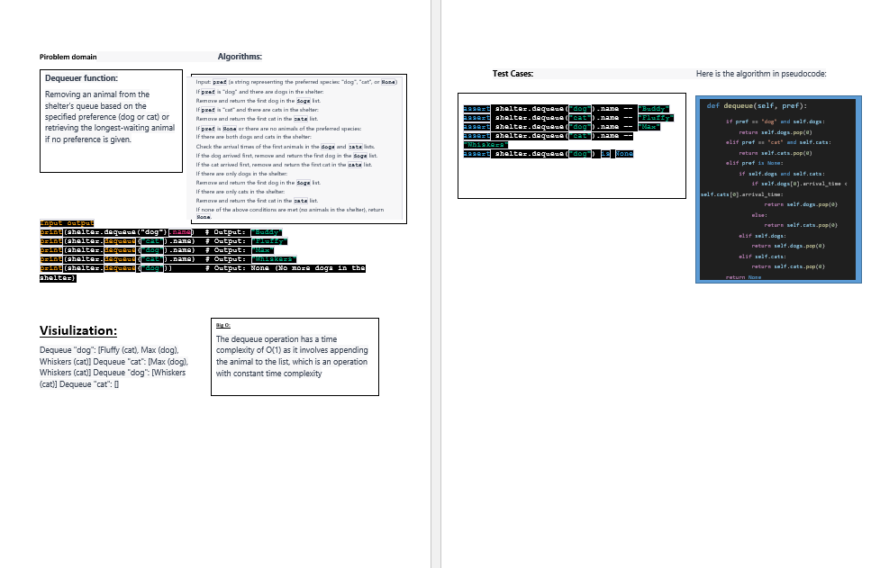

# Challenge Title
## First-in, First out Animal Shelter.

## Whiteboard Process

## Approach & Efficiency

The provided code uses a simple approach to implement the Animal Shelter using two lists to represent the dogs and cats in the shelter. The enqueue operation appends the animal to the respective list based on its species, while the dequeue operation removes and returns the first animal of the specified preference.

## big O :
The efficiency of the code is primarily dependent on the efficiency of list operations such as append and pop(0), which have constant time complexity. However, it's important to note that the implementation using lists may not be the most efficient for handling a large number of animals, as removing elements from the beginning of a list (pop(0)) can be inefficient due to the need to shift the remaining elements.

## Solution:
python3 stack_queue_animal
[code](./stack_queue_animal.py)