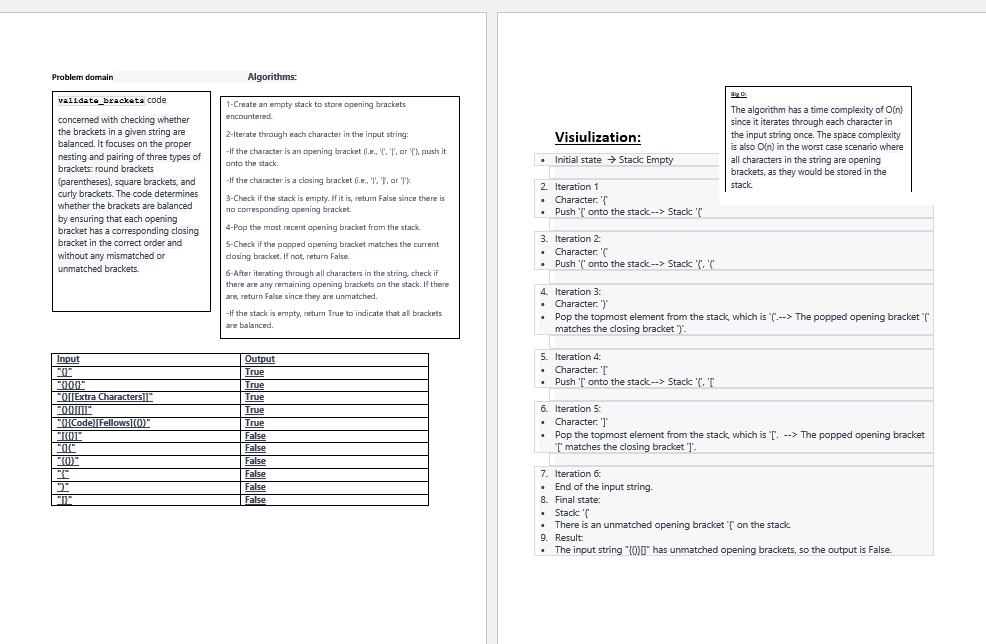
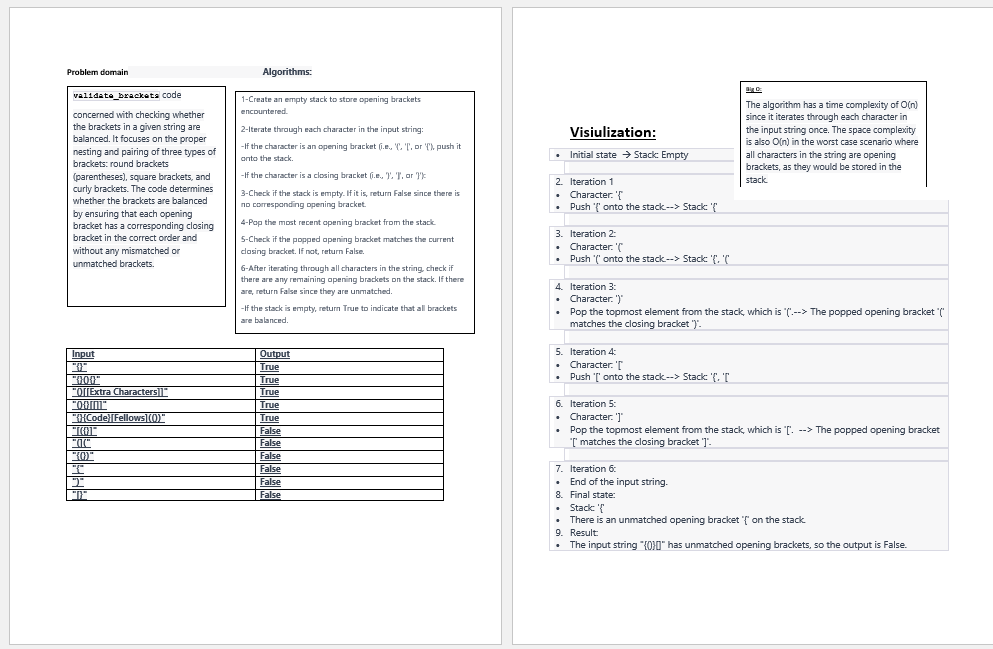

# Challenge Title:

Multi-bracket Validation.

## Whiteboard Process:

## Approach & Efficiency:
The function initializes an empty stack to keep track of the opening brackets encountered.

It iterates through each character in the input string.

If the character is an opening bracket (i.e., '(', '[', or '{'), it is pushed onto the stack.

If the character is a closing bracket (i.e., ')', ']', or '}'), the function checks if the stack is empty. If the stack is empty, it means there is no corresponding opening bracket for the current closing bracket, so the function returns False.

If the stack is not empty, the function pops the most recent opening bracket from the stack and checks if it matches the current closing bracket. If the brackets do not match, the function returns False.

After iterating through all characters in the string, the function checks if there are any remaining opening brackets on the stack. If there are, it means there are unmatched opening brackets, so the function returns False.

Finally, if the stack is empty, it means all brackets were balanced, and the function returns True

## big O :
The time complexity of the function is O(n) because it iterates through each character in the input string once. The stack operations, such as push and pop, have a time complexity of O(1). Therefore, the overall time complexity is dominated by the iteration over the input string.

The space complexity of the function is O(n) as well. In the worst case, if all characters in the string are opening brackets, they will be stored in the stack. Therefore, the space required by the stack is proportional to the length of the input string.

## Solution:
pytest tests/test_stack_queue_brackets.py
[stack_queue_brackets](./stack_queue_brackets.py)