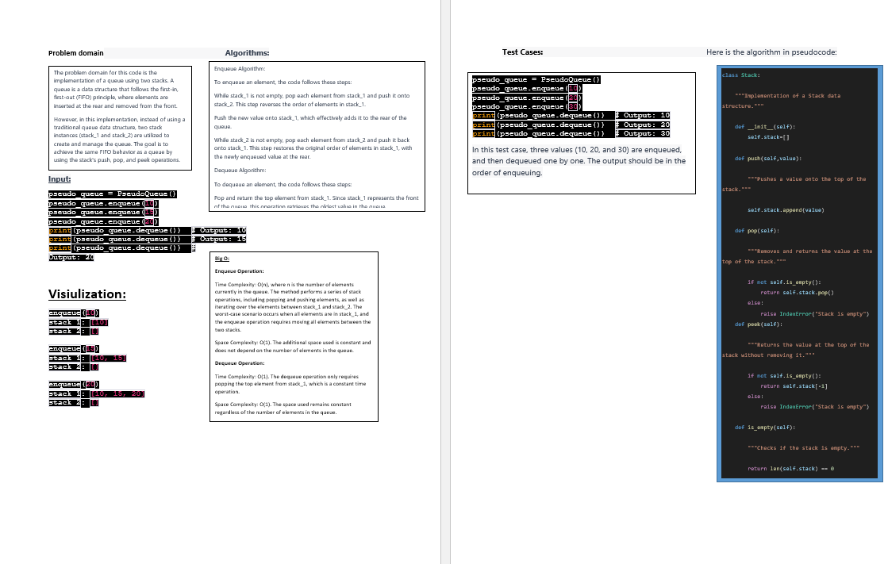

## Challenge Title

Code Challenge / Algorithm

## Whiteboard Process

## Approach & Efficiency

Two stack instances, stack_1 and stack_2, are created in the PseudoQueue class to store the elements of the queue.

The enqueue method utilizes a first-in, first-out approach. When a value is enqueued, it is first moved from stack_1 to stack_2 (reversing the order). Then, the new value is added to stack_1. Finally, the elements from stack_2 are moved back to stack_1, ensuring the first-in, first-out order is maintained.

The dequeue method extracts a value from the queue using a first-in, first-out approach. It simply pops the top element from stack_1, which represents the front of the queue.

## big O :
Enqueue Operation:

Time Complexity: O(n), where n is the number of elements currently in the queue. The method performs a series of stack operations, including popping and pushing elements, as well as iterating over the elements between stack_1 and stack_2. The worst-case scenario occurs when all elements are in stack_1, and the enqueue operation requires moving all elements between the two stacks.
Space Complexity: O(1). The additional space used is constant and does not depend on the number of elements in the queue.
Dequeue Operation:

Time Complexity: O(1). The dequeue operation only requires popping the top element from stack_1, which is a constant time operation.
Space Complexity: O(1). The space used remains constant regardless of the number of elements in the queue.

## Solution
python3 stack_queue_pseudo
[stack_queue_pseudo](./stack_queue_pseudo.py)
