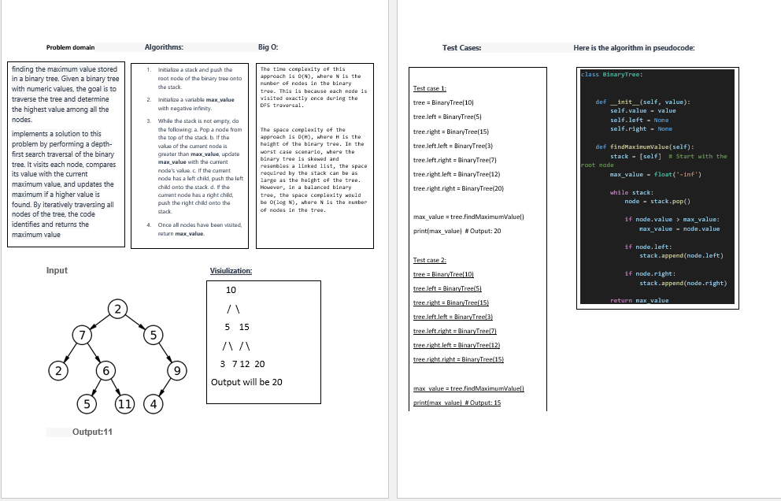

# Challenge Title

Find the Maximum Value in a Binary Tree

## Whiteboard Process

## Approach & Efficiency
The approach used in the provided code for finding the maximum value in a binary tree is a depth-first search (DFS) traversal. The algorithm uses a stack to visit each node in the tree iteratively.

Here's a breakdown of the approach:

The findMaximumValue method starts by initializing a stack with the root node of the binary tree.
A variable max_value is initialized with negative infinity.
While the stack is not empty, the algorithm enters a loop.
In each iteration, a node is popped from the stack.
If the value of the current node is greater than max_value, max_value is updated with the current node's value.
If the current node has a left child, it is added to the stack.
If the current node has a right child, it is also added to the stack.
The loop continues until all nodes in the binary tree have been visited.
Finally, the maximum value found in the binary tree, max_value, is returned.

## big O :

The time complexity of this approach is O(N), where N is the number of nodes in the binary tree. This is because each node is visited exactly once during the DFS traversal.

The space complexity of the approach is O(H), where H is the height of the binary tree. In the worst case scenario, where the binary tree is skewed and resembles a linked list, the space required by the stack can be as large as the height of the tree. However, in a balanced binary tree, the space complexity would be O(log N), where N is the number of nodes in the tree.

## Solution:

python3 tree_max.py
[code](./tree_max.py)